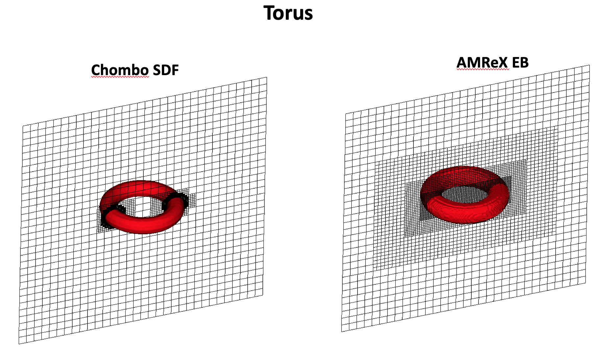
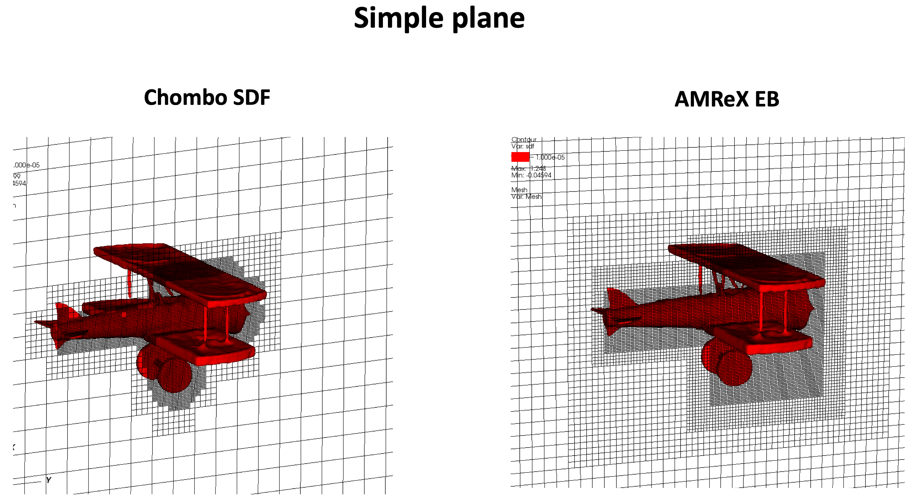
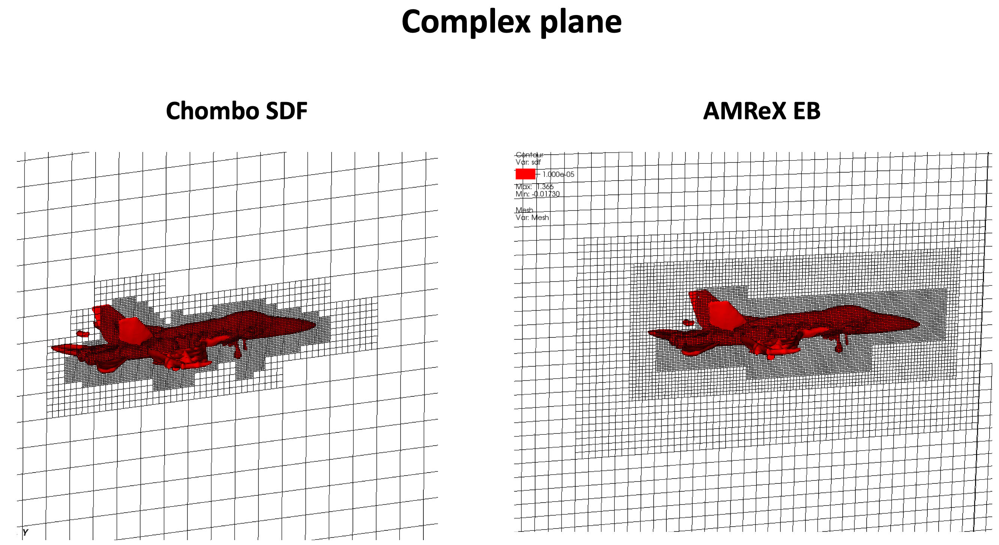
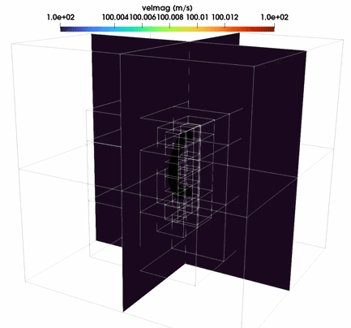
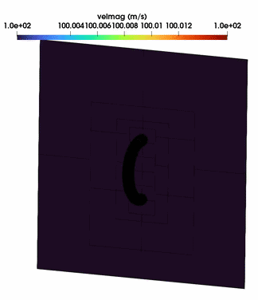

# Chombo-AMReX 

This repository contains the code that can read in signed distance function from a HDF5 file generated by Chombo and 
creates a embedded boundary in AMReX and runs a compressible flow solver on that geometry. 
See [README](https://github.com/amrex-suite/chombo_to_amrex/tree/main/CNS/Exec/Chombo_AMReX) section for details.

## Examples
Here are a few examples of the AMReX EB visualization of Chombo SDF data. The zero-contour are shown.

## Flow solver

### Flow past a Torus generated from Chombo SDF in AMReX

<table>
  <tr>
    <td align="center"> <b>Torus View 1</b></td>
    <td align="center"> <b>Torus View 2</b></td>
  </tr>
</table>

