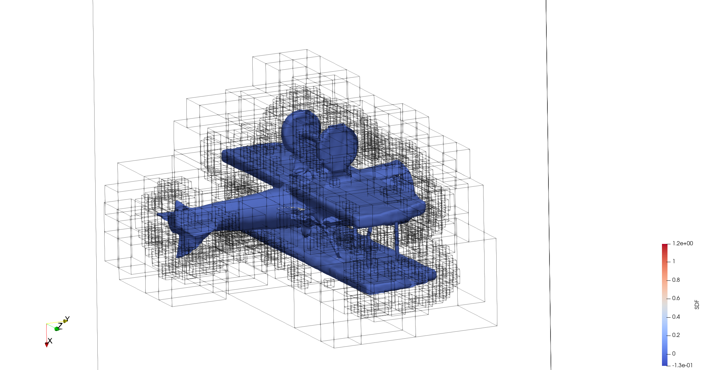
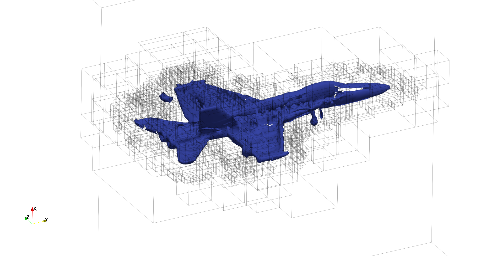

# Chombo HDF5 to AMReX Plotfile Converter

This utility converts a Chombo-style HDF5 file containing a Signed Distance Function (SDF) into an AMReX plotfile.

The converter:

- Reads the AMR hierarchy from the HDF5 file.
- Reads the grid boxes and domain information for each AMR level.
- Reads the SDF data.
- Stores the data in AMReX `MultiFab` objects.
- Writes a standard AMReX multi-level plotfile.

## Requirements

- C++ compiler
- HDF5
- AMReX

## 1. Build AMReX

Clone the AMReX repository:

```bash
git clone https://github.com/AMReX-Codes/amrex.git
cd amrex
mkdir build
cd build
cmake .. \
    -DCMAKE_INSTALL_PREFIX=$HOME/amrex-install \
    -DAMReX_MPI=ON \
    -DAMReX_BUILD_SHARED_LIBS=ON \
    -DAMReX_BUILD_TESTS=OFF \
    -DAMReX_BUILD_EXAMPLES=OFF
cmake --build . -j8
cmake --install .
```

## 2. Compile the code
Set the path to the HDF5 and AMReX installation in the `Makefile`:
```
cd chombo_to_amrex
make -j8
```

## 3. Run
```
./main.exe --chombo-hdf5-file=<hdf5-filename> --amrex-plt-file=<plt-filename>
```
This will read the Chombo-style hdf5 file and output an AMReX-style plt file that can be visualized in VisIt or ParaView.


## Examples
Here are two examples of the AMReX plotfile visualization of Chombo-style HDF5 data. The zero-contour of the SDF is shown.
### Simple plane

### Complex plane


